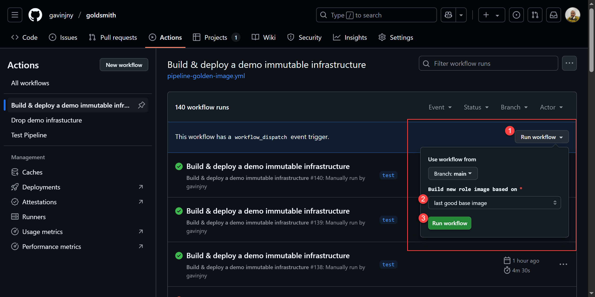

# About
This project is a demonstration Github pipeline(Goldsmith) to create, update and deploy golden images. The infrastructure hosts http://www.gavinjny.com, which only displays a copy of my resume. The pipeline modifies AWS AMI, EC2, ASG, ALB. 

**Features**
1.	Updates golden image and EC2s on AWS
2.	Creates new or use existing golden image
2.  Deploys Ubuntu EC2 using rolling deployment
3.  Uses auto scaling
3.	Automated testing of images
4.	Automated end to end
5.	Application management
6.	Monitoring with CloudWatch
7.	Test result notification via email

**Skills Demonstrated**
1.	Bash
1.	Ansible
1.	Terraform 
1.	Packer
1.	Linux 
1.	Debugging
1.	SSH certification usage
1. Git Actions pipeline
1. AWS (EC2, AMI, ASG, ALB, IAM, Cloudwatch)
1. MySQL
1. Yaml
1. HCL
1. Linux
1. Credential security

# Pipeline 1: Build & deploy immutable infrastructure on AWS
## Getting Started
Follow these steps to run the pipeline(Goldsmith). This repo's pipeline is only available to me. You would have to clone the repo and customize for your AWS account,.
1. Go to GitHub Actions
1. Select "Build & deploy a demo immutable infrastructure" pipeline
    1. Click Run Workflow
    1. Choose if deployment should use new base image or existing base image
    1. Click run workflow

## Steps Followed
### 1. Create base image
Create or update Ubuntu base image - Packer
1. Change timezone
1. Update software
1. Was the build success?
    1. Yes - Tag the image with v[Date].[Base image build ID]
    1. No – Delete image
### 2. Create role image
1. Create child image – role specific changes(web, db)
    1. Customize server - Ansible
    1. Test deployment - Ansible assertion
        1. Latest patches 
        1. Timezone change to New York
        1. Services running with Ansible
        1. Localhost requests are working
    1. Was the build success?
        1. Yes - Tag the image with name of v[Date].[Base image build ID].[Role image build ID]
        1. No – Delete image

### 3. Deploy role image
**Terraform**
1. Rolling deployment of the latest role image - ALB
1. Create autoscaling group - ASG

## Todo
1. Use Inpec for testing
1. Setup incident tracking using Cloudwatch and Trello
1. Show golden signals with Cloudwatch
1. Create dashboard
1. Use OPENSCAP for compliance testing
1. Application meta data validation – ansible
1. Confirms image metadata - Ansible test modules (assert, setup) or InSpec
1. Testing - Synthetic checks with Playwrite
1. Testing - Security checks with Lynis (lightweight, Linux-specific)

# Pipeline 2: Reset of AWS environment
Shutdown and delete all AWS test services/instances
- Ensures I dont get charged for unused AWS instances and services
- Reset AWS assets to zero to show process can run from scratch

